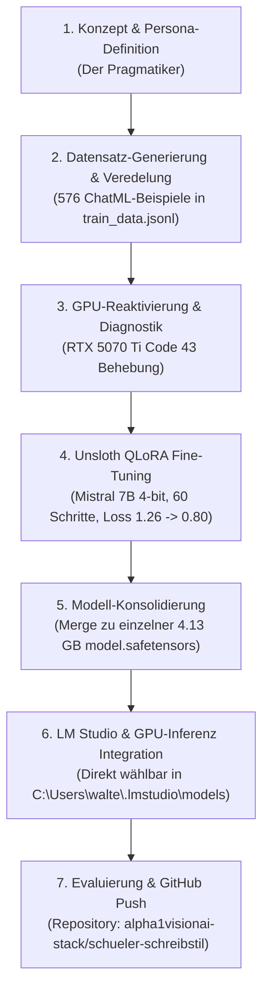

# Walkthrough: Vom Konzept zum fertigen Schülerstil-LLM

Dieses Dokument beschreibt Schritt für Schritt den gesamten Entwicklungsprozess vom ersten Konzept bis zum fertigen, konsolidierten LLM-Modell und dessen Verteilung.

---

## 📐 Übersicht des Gesamtprozesses



---

## 1. Konzeption & Persona-Definition

* **Ziel:** Entwicklung eines LLMs, das im authentischen Schreibstil eines Oberstufenschülers (*Persona: Der Pragmatiker*) antwortet.
* **Stil-Merkmale:**
  * Klares, strukturierte Argumentation (nummerierte Punkte, pragmatische Zusammenfassungen).
  * Natürliches Schüler-Deutsch ohne künstliche KI-Floskeln (*"In der heutigen, sich rasant entwickelnden Welt..."* streichen).
  * Vermeidung von übertriebener Lehrbuch-Sprache oder distanzierter *"Sie"*-Ansprache.
* **Artefakte:** `wikipedia_konzept.md`, `wikipedia_style_samples.json`.

---

## 2. Datensatz-Generierung & Formatformatierung

* **Generierung:** Erstellung von 576 kuratierten Konversationsbeispielen über `generate_dataset.py` und Bereinigung über `clean_dataset.py`.
* **Formatierung:** Strikte Ausrichtung auf das von Unsloth und Hugging Face geforderte **ChatML / OpenAI Messages** Format:
  ```json
  {
    "messages": [
      {"role": "system", "content": "Du bist ein Oberstufenschüler..."},
      {"role": "user", "content": "..."},
      {"role": "assistant", "content": "..."}
    ]
  }
  ```
* **Validierung:** Erfolgreiche Überprüfung durch `validate_unsloth_format.py`.

---

## 3. GPU-Diagnostik & Re-Initialisierung

* **Ausgangslage:** Die **NVIDIA GeForce RTX 5070 Ti Laptop GPU** befand sich durch vorherige Hintergrundprozesse im Windows-Fehlerzustand **Code 43** (`CM_PROB_FAILED_POST_START`).
* **Ursachen-Analyse:** LM Studio lief als Hintergrunddienst (`LM Studio.exe --run-as-service`) und blockierte zusammen mit Unsloth den VBIOS-Handshake beim Systemstart.
* **Lösung:** Beendigung aller blockierenden Prozesse (LM Studio, Unsloth, llama-server) und schnelles Re-Aktivieren der Grafikkarte im Geräte-Manager ohne Neustart (`CUDA Available: True`, 11.94 GB VRAM bereit).

---

## 4. Unsloth QLoRA Fine-Tuning auf der GPU

* **Framework:** Unsloth AI + PyTorch 2.11 + CUDA 12.8 mit Triton-Optimierung & Bfloat16.
* **Basismodell:** `unsloth/mistral-7b-instruct-v0.3-bnb-4bit` (3.85 GB).
* **Trainingsverlauf (`train.py`):**
  * **Datensatz:** 576 Beispiele über `formatting_prompts_func` in den Unsloth `SFTTrainer` eingespeist.
  * **Schritte:** 60/60 Epochen-Schritte.
  * **Loss-Entwicklung:** Von **1.2645** kontinuierlich gesunken auf **0.8010**.
  * **Ergebnis:** Gespeicherter LoRA-Adapter in `lora_model_schueler/` (167.8 MB).

---

## 5. Modell-Konsolidierung (Single Merged Model)

* **Anforderung:** Erstellung eines **einzelnen, eigenständigen Modells** anstelle eines reinen Adapters.
* **Durchführung (`export_merged.py`):**
  * Verschmelzung der LoRA-Gewichte direkt mit den 4-bit Basismodell-Gewichten via `save_method = "merged_4bit_forced"`.
* **Ergebnis-Ordner:** [`schueler_model_merged/`](file:///d:/Development_D/Antigravity/Schreibstil%20Sch%C3%BCler/schueler_model_merged) mit einer einzigen konsolidierten **`model.safetensors` (4,13 GB)**.

---

## 6. LM Studio Integration

* **Ziel:** Direkte Auswählbarkeit beider Modelle in der LM Studio Benutzeroberfläche.
* **Struktur in `C:\Users\walte\.lmstudio\models\`:**
  1. **Original-Basismodell:**  
     `C:\Users\walte\.lmstudio\models\unsloth\mistral-7b-instruct-v0.3-bnb-4bit\`
  2. **Trainiertes Schülerstil-Modell:**  
     `C:\Users\walte\.lmstudio\models\schueler-style\mistral-7b-schueler-schreibstil-merged\`

---

## 7. Evaluierung & GitHub Push

* **Test-Skripte:** `test_inference.py`, `run_comparison.py`, `test_ai_rewrite.py`.
* **Ergebnisse:** 
  * Dokumentation in [`TEST_SZENARIEN_VERGLEICH.md`](file:///d:/Development_D/Antigravity/Schreibstil%20Sch%C3%BCler/TEST_SZENARIEN_VERGLEICH.md).
  * Erfolgreicher KI-Floskel-Eliminierungstest (*De-AI-fizieren*).
* **GitHub Repository:**  
  Initialisiert, mit `.gitignore` & `README.md` versehen und gepusht nach:  
  👉 [https://github.com/alpha1visionai-stack/schueler-schreibstil](https://github.com/alpha1visionai-stack/schueler-schreibstil)

---

> [!TIP]
> Um ein neues Training oder eine Inferenz durchzuführen, nutze `python train.py` bzw. `python test_inference.py`.
